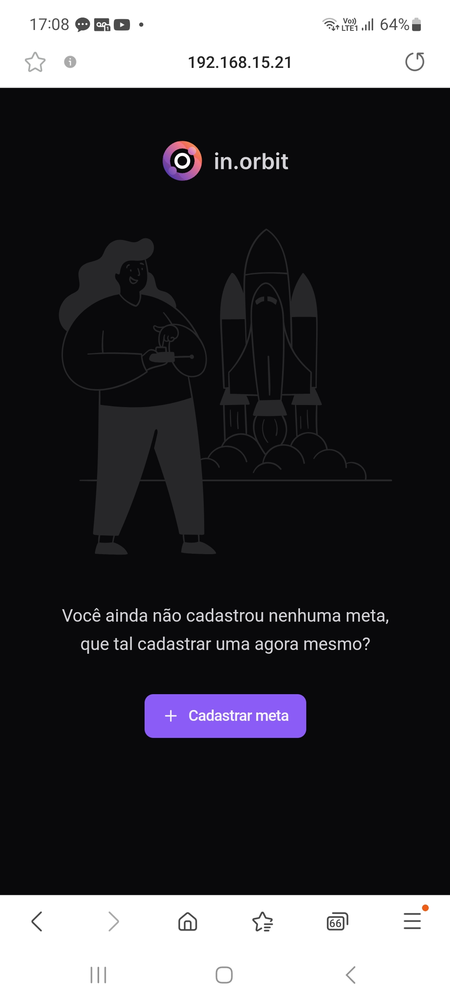
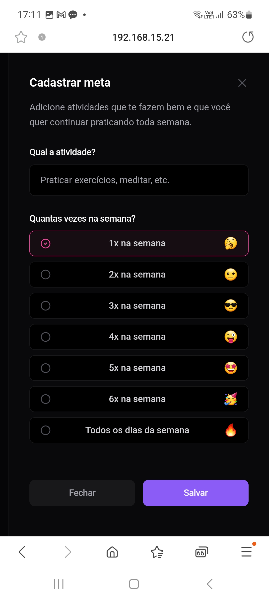
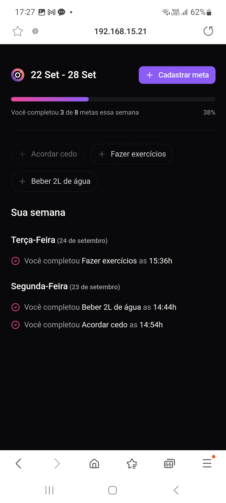

# nlw-pocket-js

## 🚀 Projeto
Um app (backend / frontend) para acompanhar tarefas e objetivos. Projeto desenvolvido no curso "NLW - Pocket - Javascript" da [@Rocketseat](https://www.rocketseat.com.br) em set/24.</br>

<div align="center">
    
    
    
</div>

## 🛠️ Tecnologias
- 📊 Backend: [Node.js](https://nodejs.org/en/) | [Fastify](https://fastify.dev) | [Drizzle ORM](https://orm.drizzle.team) | [Docker](https://www.docker.com)
- 🖼️ Frontend: [React](https://pt-br.reactjs.org) | [Vite](https://vitejs.dev) | [Tailwind CSS](https://tailwindcss.com)

## 🧊 Cool features:
- Interface responsiva usando [useQuery](https://tanstack.com/query/v4/docs/framework/react/reference/useQuery);
- Queries complexas usando [Common Table Expressions](https://www.postgresql.org/docs/current/queries-with.html);
- Controle de campos do formulário usando o React Hook [useForm](https://react-hook-form.com/docs/useform);

## 🗂️ Utilização

### 🐑🐑 Clonando o repositório:

```bash
  $ git clone url-do-projeto.git
```

### ▶️ Rodando o App:

🐳 Terminal 1: Docker
```bash
  $ cd back                   #change to this directory
  $ docker compose up         #build the image and runs the container
  $ ctrl + C                  #stop the container
  $ docker compose down       #delete the container
```

📊 Terminal 2: Backend
```bash
  $ cd back                   #change to this directory
  $ npm install               #download dependencies to node_modules
  $ npx drizzle-kit generate  #creates migration.sql file. Optional, since repository already has the migration.sql files to create the tables in the db
  $ npx drizzle-kit migrate   #run the migrations to the db, creating the tables
  $ npm run seed              #populates the db with data from the db/seed.ts file
  $ npx drizzle-kit studio    #Optional: db management thru a control panel in a web browser tab. OBS: do not use Safari
  $ npm run dev               #start the project
```

🖼️ Terminal 3: Frontend
```bash
  $ cd front       #change to this directory
  $ npm install    #download dependencies to node_modules
  $ npm run dev    #start the project
```

## ⭐ Like, Subscribe, Follow!
Curtiu o projeto? Marque esse repositório com uma Estrela ⭐!